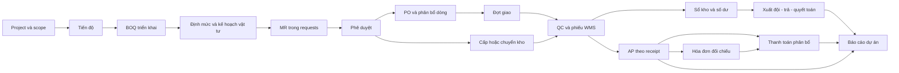

# Vioo — Audit ERP xây dựng end-to-end

Ngày: **19/09/2026**. Phạm vi: Dự án, BOQ, Vật tư, Procurement, WMS, các luồng công nợ–thanh toán–chi phí liên quan.

**Đây là báo cáo AS-IS / TO-BE để thống nhất thiết kế, không phải kế hoạch implementation được duyệt. Không sửa code ứng dụng, không triển khai migration, không sửa chứng từ.**

**Bổ sung theo yêu cầu ngày 19/09:** [M — Audit worktree Procurement](#m-audit-worktree-procurement--khả-thi-và-mức-sẵn-sàng) và [N — Góp ý mua hàng–kho, tham khảo doanh nghiệp lớn](#n-góp-ý-nghiệp-vụ-mua-hàngkho-và-tham-khảo-doanh-nghiệp-lớn). Thiết kế Workbench khả thi; phần triển khai hiện mới ở nền, chưa sẵn sàng vận hành giao dịch.

## Cơ sở và giới hạn kiểm chứng

- Source: checkout `/Users/admin/khotienthinh`, commit `c9677b0`; worktree đang mở trong IDE `authorization-v2-task12-4-2` cùng commit tại thời điểm bắt đầu. Không gộp các nhánh khác vào AS-IS.
- Cloud: đối chiếu project CLI với hostname `VITE_SUPABASE_URL` trong `.env`; mọi SQL audit dùng `BEGIN READ ONLY`, timeout 25 giây, `ROLLBACK`. Migration mới nhất đọc được: `20260918105055`. Không dùng Supabase local/Docker. Chỉ lưu thống kê, schema và function liên quan; không lưu credential.
- UI: quan sát trực tiếp Vioo PWA đang đăng nhập bằng tài khoản quản trị, giao diện desktop khoảng 1226×768: Mua hàng công ty, danh sách dự án, Vật tư/Tổng hợp, danh sách và chi tiết PO-360, Tài chính công trình, Kho & Vật tư. Không tạo/duyệt/nhận/chi tiền qua UI. Bản deploy chưa đối chiếu build SHA với checkout: kết luận UI và code được ghi riêng khi cần.
- Test: chạy **14 file, 75 test, 75 pass** liên quan PO, receipt, returns, payable/payment, planning, trace và finance. Phần lớn là unit/mock/contract; không chứng minh RLS theo từng vai trò, cạnh tranh giao dịch, hay end-to-end Cloud đã qua.
- Audit cũ 10/09 chỉ dùng làm đầu mối; các phát hiện đưa vào đây đã đọc lại source hoặc kiểm tra Cloud mới. Không coi vấn đề UX đã sửa trong audit cũ là lỗi còn tồn tại.
- Chưa kiểm thử mobile thật, dark mode đầy đủ, keyboard/screen reader toàn luồng, mạng chậm, tài khoản thủ kho/QS/kế toán tách biệt; chưa phỏng vấn người vận hành hay đối chiếu kiểm kê vật lý/chứng từ kế toán. Không có benchmark p95 hoặc React profiler. Không tuyên bố đã chứng nhận toàn hệ thống.
- Mức bằng chứng: **CLOUD** = trạng thái thực đọc được; **CODE** = logic source/function; **UI** = quan sát trực tiếp; **RISK** = tình huống suy ra cần nghiệm thu; **TO-BE** = đề xuất.

Bằng chứng tái kiểm tra: [overview](cloud-overview.json), [schema/RLS/functions](cloud-structure.json), [đối soát](cloud-reconciliation.json), [follow-up PO/index/trigger](cloud-followup.json), [test results](test-results.json). Các file `.sql` cùng tên là truy vấn chỉ đọc; các file `public.*.sql`, `app_private.*.sql` là **bản chụp định nghĩa**, không phải migration để chạy.

## A. Executive Summary

**Vioo đã có bộ khung ERP xuyên module, nhưng chưa đạt một nguồn sự thật thống nhất từ kế hoạch tới báo cáo quản trị.** Điểm yếu lớn nhất là các nguồn tổng hợp và đường ghi giao dịch chưa đồng nhất, không phải thiếu toàn bộ chức năng PO/kho/tài chính.

Nên giữ: BOQ gắn công tác; snapshot ĐVT mua/kho; liên kết dòng MR–PO; nhiều đợt giao có giá riêng; QC và hoàn tất nhận tách bước; RPC nhận hàng có khóa/idempotency; sổ kho; xuất đội/hoàn trả/quyết toán; AP theo nguồn; thanh toán có phân bổ; RLS/capability; graph chứng từ và audit trigger.

Ba ưu tiên quản trị:

1. **Đối soát và xác định nguồn chính thức của tồn, giá vốn, công nợ, chi phí, tiền.** Cloud có 42 cặp vật tư–kho lệch giữa `items.stock_by_warehouse` và tổng `inventory_balances`; 18 dòng số dư âm; 17 dòng số lượng 0 còn giá trị; 2 dòng số lượng dương, giá trị âm. Các tập có thể giao nhau; không cộng thành tổng lỗi. Đây chưa phải kết quả kiểm kê vật lý.
2. **Sửa hợp đồng đọc dữ liệu trước khi tin dashboard.** KPI gọi bảng PO không tồn tại; một PO đã nhận hiển thị thực nhập 0; AP theo đợt nhận có thật nhưng drawer PO báo không có; nhãn “Đã chi” đang dùng chi phí ghi nhận.
3. **Chuẩn hóa command và ownership trên những đường còn ghi nhiều bước.** Nhận đợt cấp, lưu liên kết PO/lịch giao và draft thanh toán có cửa sổ ghi dở dang. Giữ mô hình command hiện có, mở rộng có chọn lọc; không viết lại ERP.

Ảnh chụp dữ liệu Cloud:

| Quan sát | Kết quả | Diễn giải |
|---|---:|---|
| PO | 56 | 48 từ yêu cầu, 8 chủ động dự án; chưa có PO công ty gộp trong dữ liệu đọc được |
| MR dự án trong `requests` | 61 | `project_material_requests` cũ có 0 dòng; chưa có bằng chứng hai bảng đang ghi trùng |
| Allocation MR–PO | 114 | Không có dòng mất tham chiếu dòng JSON theo phép kiểm tra hiện tại |
| View anomaly PO | 0 dòng | Chỉ khẳng định các quy tắc trong view không báo bất thường |
| Ledger quantity so với balance | 0 lệch | Không có nghĩa số dư đúng với WMS hoặc kiểm kê |
| AP hoạt động | 7 receipt + 18 statement | Hai nguồn nghiệp vụ đã được dùng |
| Supplier invoices / payment batches | 0 / 0 | Chưa có bằng chứng vận hành thực tế hai chặng cuối trong các bảng này |
| RLS | Bật ở toàn bộ bảng trong tập truy vấn | Không đồng nghĩa policy đúng với mọi vai trò |
| View liên quan được kiểm tra | 4/4 `security_invoker=true` | Điểm tốt cần giữ |

Kết luận “một hồ sơ xuyên suốt”: **đạt một phần ở quan hệ chứng từ, chưa đạt đồng nhất ở cấp dòng, giá trị, UX và reporting**. Không cần một form khổng lồ hay một bảng dùng chung cho mọi phòng ban; cần định danh nguồn bền vững, phân bổ nhiều–nhiều và sự kiện được ghi đúng một lần.

## B. Architecture Map

| Module / khu vực | Trách nhiệm AS-IS | Nguồn dữ liệu chính | Dependency và điểm giao |
|---|---|---|---|
| Project master / tổ chức | Dự án, công trường, nhân sự, quyền | `projects`, `project_staff`, kho–site binding, room/capability | Scope cho mọi chứng từ; các RPC create/update/staff đã có |
| Schedule / QS | Công tác, baseline, tiến độ, BOQ hợp đồng/triển khai | `project_tasks`, `project_work_boq_items`, contract items, baselines | `sourceTaskId` → BOQ triển khai → vật tư |
| Material | Danh mục, định mức, kế hoạch và nhu cầu | `items`, `material_budget_items`, `material_planning_rules`, `requests.items`, snapshots | Kế thừa ĐVT/mã, MR được phân bổ sang cấp kho hoặc PO |
| Workflow | Giao việc, duyệt, trả sửa, lịch sử | workflow subjects/instances/history, notifications | Guard dependency, quyền actor và stage |
| Procurement dự án/công ty | Gom nhu cầu, NCC, PO, đợt giao, mua nóng | `purchase_orders.items`, request allocations, delivery batches/lines/groups, RFQ phi tiêu chuẩn | WMS nhận dữ liệu giao; AP nhận nguồn chứng từ |
| WMS | Nhập/xuất/chuyển/điều chỉnh, QC, tồn | `transactions.items`, fulfillment, inventory ledger/balances, `items.stock_by_warehouse` | Đang có hai biểu diễn tồn cần đối soát |
| Thi công / xuất đội | Cấp phát, ký nhận, còn giữ, trả, quyết toán | `material_issue_*`, party balance | Không đồng nhất xuất kho với tiêu hao thực tế |
| Finance | AP, hóa đơn, phân bổ thanh toán, dòng tiền, ngân sách | `supplier_payable_*`, `supplier_invoices`, payment batches/allocations, `project_transactions`, cash settlement | Có nhiều service tổng hợp tài chính với công thức khác nhau |
| Cross-module trace | QR, liên kết chứng từ, timeline | `project_document_links`, audit logs, action logs | Đã có graph nhưng chưa bao phủ schedule/BOQ/delivery như node độc lập |

Sơ đồ thể hiện đường hỗ trợ trong code/schema, không khẳng định mọi nhánh đã có dữ liệu thực đầy đủ.

## C. AS-IS Process

| Actor → Action | Data → Status | Module → Next step | Nút nghẽn / điều cần giữ |
|---|---|---|---|
| QLDA → tạo dự án, gắn site/kho | Project, nhân sự và quyền | Project → lập tiến độ | RPC master/staff là nền tốt; scope project/site cần thống nhất xuyên chứng từ |
| QS/kỹ sư → lập task, BOQ triển khai, định mức | Task/baseline → work BOQ → material budget | Project → kế hoạch vật tư | Có liên kết `sourceTaskId`, quy tắc lead time/curve 7–30–90 ngày; giữ cảnh báo thiếu mapping |
| Cán bộ vật tư → chọn dòng BOQ hoặc nhóm vật tư | MR + snapshots, gửi/duyệt/trả sửa | Material/Workflow → phân nguồn | Tạo từ nhóm tổng hợp giữ danh sách nguồn snapshot nhưng mặc định ngoài BOQ, qty 0 chờ nhập; thiếu phân bổ lượng theo công tác |
| Người duyệt → quyết định theo quyền | Workflow và trạng thái hồ sơ | Workflow → mua/cấp | Đã có guard chứng từ sau; cần tách sửa nội dung hồ sơ với thu hồi nhu cầu đã cam kết |
| Mua hàng → chọn nhu cầu, NCC, lượng, giá | PO `draft → sent → confirmed` và allocations | Procurement → đơn/đợt giao | Công ty gom theo NCC, dự án có đường riêng; công thức nhu cầu chưa đồng nhất |
| Mua hàng → tạo/duyệt đợt | Batch/line, giá và VAT đợt, WMS dự kiến | Procurement → kho | V2 dùng command; company/legacy còn fulfillment group và nhiều bước client |
| Thủ kho/QC → xác nhận giao và chấp nhận | `quality_approved`, WMS `APPROVED` | WMS → hoàn tất nhận | Backend lưu delivered và accepted riêng; projection frontend thiếu delivered ở một số đường |
| Thủ kho → hoàn tất | Batch received/short/over, WMS completed, ledger/AP liên quan | WMS → xuất dùng/tài chính | V2 khóa row và retry; đường `receiveBatch` cũ cập nhật dòng trước validation WMS |
| Kho/đội → xuất, ký nhận, trả, quyết toán | Issue/receipt/return/settlement | WMS + Project → lượng đã dùng/còn giữ | Mô hình tốt, UI thực tế còn nhiều dòng chưa quyết toán; không nên coi đó là lỗi phần mềm tự động |
| Kế toán → đối chiếu NCC | AP receipt hoặc statement, hóa đơn và variance | Finance → thanh toán | Có mô hình many-to-many AP–invoice nhưng công thức variance chưa phù hợp partial/multi-project |
| Kế toán → draft phân bổ, post/đảo | Payment batch → project transaction | Finance → cash/reporting | Post server có quyền/khóa/source ref; lưu draft còn nhiều HTTP request; Cloud chưa có batch |
| Điều hành → xem KPI/dataset | Nhiều service tổng hợp | Dashboard → chứng từ | Có drill-through từng phần; tên và nguồn chỉ tiêu chưa thống nhất |

### Ba nhánh vật tư cần phân biệt

- **Mua theo PO:** MR hoặc nhu cầu chủ động → PO → delivery → QC → receipt → AP. `from_request` và `proactive_project` đều đang có dữ liệu, nhưng không phải mọi đường cùng implementation.
- **Giao theo HĐ NCC:** hợp đồng → phiếu giao trực tiếp → WMS → bảng đối chiếu → AP. Có 18 AP hoạt động theo statement; không nên ép tạo thêm PO giả chỉ để làm đẹp sơ đồ.
- **Mua nóng/CCDC và chuyển kho:** mua nóng có ứng/hoàn ứng, CCDC có vòng đời riêng; chuyển kho không tạo AP mới. Các đường này cần cùng chuẩn lineage, không cần cùng số bước.

### PO capability matrix

| Nghiệp vụ | AS-IS | Đánh giá |
|---|---|---|
| Partial / multiple delivery | Batches/lines, fulfillment groups, single/multiple mode | Có, không cần xây lại |
| Một nhu cầu nhiều NCC | PO công ty gom theo NCC; package có supplier ở batch | Có mô hình; cần phân định package nội bộ và PO pháp lý theo NCC |
| Giá khác theo đợt | `delivery_unit_price`, VAT và phê duyệt bổ sung | Có; giữ snapshot, không sửa giá lịch sử đã nhận |
| Partial receipt | Accepted < delivered/planned, short status | Có theo từng đợt; một batch gắn một WMS, nhiều lần nhận thực tế nên tách batch hoặc receipt event |
| Ordered / remaining | JSON PO + allocations + batches | Có nhưng công thức và ĐVT không đồng nhất giữa màn |
| Received / returned | PO JSON và delivery lines, supplier returns | Có; nhiều số tổng song song gây mâu thuẫn UI |
| Cancelled / close short | Cancel unreceived, close package short, closures | Có thao tác; chưa một sổ lượng cancelled theo dòng dùng chung mọi đường |
| Over/under delivery | Received over/short, lý do và QC | Có; tolerance, duyệt tiền tăng cần nghiệm thu từng mode |
| Status PO vs delivery | Hai state machine riêng và UI mapping | Đúng hướng; “Hoàn thành” PO chưa phải hoàn tất AP/hóa đơn/thanh toán |
| Invoice matching | Header hóa đơn–AP allocations và chênh lệch tiền | Chưa đầy đủ 3-way matching ở dòng PO–receipt–invoice |

## D. Pain Points

Severity dựa trên hậu quả tiềm tàng; **Critical không có nghĩa đã chứng minh gian lận hoặc mất tiền thực tế**. Mỗi mục dưới có bằng chứng, tác động và hướng xử lý/migration. Các mục chung nguyên nhân được gom, không biến báo cáo thành hàng trăm task ngang nhau.

### F01 — Critical — Tồn WMS và tồn sổ chưa cùng một sự thật

**CLOUD:** 42 cặp lệch trên phép full outer theo vật tư–kho; tổng ledger quantity khớp balance theo project/site (0 lệch). 18 dòng âm, 17 dòng qty 0 còn value, 2 dòng qty dương/value âm. Phép đo bao gồm toàn bộ kho, không lọc kho archived; 42 không so trực tiếp với con số 20 của audit cũ vốn phạm vi hẹp hơn.

**CODE:** `app_private.post_inventory_ledger_entry` tính delta value bằng qty × giá đầu vào; `sync_wms_transaction_to_inventory_ledger` lấy `items[].price`, thiếu thành 0 cả xuất/chuyển. Có 147 bút toán purchase receipt giá 0, 100 project issue giá 0; đây là bút toán, không phải số phiếu hay tự động là lỗi mới.

**Vì sao thiết kế có thể như vậy:** bổ sung ledger sau WMS cũ, tận dụng payload giá; hợp lý cho chuyển đổi ban đầu nhưng chưa đủ làm nguồn kế toán chính thức. **Rủi ro:** mua thừa/thiếu, định giá sai, chi phí sai. **TO-BE:** chốt chính sách giá vốn và tồn khả dụng; ledger authoritative, cache tồn chỉ là projection sau đối soát. **Thay đổi:** refactor có phạm vi WMS–Finance–Planning, kèm reconciliation dữ liệu. **Migration:** đóng mốc, đối chiếu nguồn/đầu kỳ/ĐVT/đảo chứng từ, lập điều chỉnh được duyệt; tuyệt đối không copy một cột đè cột kia hay suy giá 0 thành giá danh mục hiện tại.

### F02 — Critical — Nguồn và định nghĩa KPI tài chính sai lệch

**CODE+CLOUD:** `lib/projectFinancialService.ts:98` gọi `project_purchase_orders`, Cloud trả relation null. Helper trả `{data:null,error}`, caller `.then(r => r.data || [])` bỏ lỗi → PO có thể biến thành 0. Cùng file tính forecast bằng actual + toàn bộ subcontract + PO mở, khác `buildFinancialSummary` dùng max(actual,budget). Budget thiếu lại fallback giá trị hợp đồng. Certified revenue không lọc customer như finance workspace đã làm.

**UI+CODE:** Tài chính dự án hiển thị “Đã chi” 320.356.250 đ, “Đã thanh toán NCC” 0; `ProjectFinanceWorkspace.tsx:3542` gắn nhãn “Đã chi” với `summary.actualCost`, không phải cash out. Không kết luận toàn bộ 320 triệu là tiền đã chi.

**Giữ:** tách classification expense recognition/payment đã có. **TO-BE:** một catalog chỉ tiêu và selector dùng chung, lỗi nguồn phải hiện “không đủ dữ liệu”; chi phí, cam kết chưa thực hiện, tồn và tiền tách biệt. **Thay đổi:** sửa nhỏ nhãn/nguồn đọc ngay, chuẩn hóa công thức cần quyết định nghiệp vụ. **Migration:** version chỉ tiêu, chạy song song dataset cũ/mới, giải thích chênh lệch; không sửa chứng từ chỉ để khớp dashboard.

### F03 — High — PO đã nhận nhưng drawer báo 0 và không có AP

**UI:** PO-360 có “Đã nhận 71/71”, 100%, đồng thời “Đã duyệt đặt 0”, “Đã thực nhập 0”, “Còn lại 71”, và “Chưa có chứng từ công nợ”. **CLOUD:** PO delivered, 3 dòng, accepted qty 71, JSON received 71, 1 AP nguồn `purchase_delivery_receipt`; batch `status=received` nhưng `approval_status=draft`. **CODE:** `PurchaseOrderCockpitDrawer.tsx:374` chỉ tính batch `approvalStatus === approved`; batch single đã nhận nhưng còn approval_status draft bị loại khỏi tổng này. Projection chung có lấy approval_status; lỗi này không phải do thiếu cột trong projection chung. `SupplyChainTab.tsx:6296` chỉ tìm AP `source_type=purchase_order, source_id=po.id`, bỏ nguồn `purchase_delivery_receipt` theo batch.

**Nguyên nhân thiết kế:** màn cũ đọc theo PO, luồng mới ghi nhận theo receipt. **Rủi ro:** người dùng tưởng chưa nhận/chưa có công nợ và xử lý lại. **TO-BE:** read model PO gom mọi receipt/AP hợp lệ theo quan hệ nguồn; thiếu quyền/không tải được phải khác không có dữ liệu. **Thay đổi:** sửa projection/filter/selector, không cần refactor toàn PO. **Migration:** kiểm tra dữ liệu có thật trước; không tạo thêm AP để chữa lỗi hiển thị.

### F04 — High — Nhu cầu còn mua bị trừ cam kết sai ở màn công ty

**CODE:** `companyProcurementService.ts:182–211` cộng toàn bộ `orderedQty` của PO còn active, rồi `resolveDemandLine` trừ khỏi `openNeedQty` vốn đã trừ thực nhận. Màn dự án `SupplyChainTab.tsx:2867` lại lấy ordered − received. Ví dụ cùng đơn vị: duyệt 100, đặt 80, đã nhận 30 → còn cần đáp ứng 70, đang chờ nhận 50, phải mua thêm 20; code công ty cho max(0,70−80)=0.

**Giữ:** key request ID + line ID và chunk pagination. **Rủi ro:** bỏ sót nhu cầu, đặc biệt partial. **TO-BE:** demand balance theo dòng và ĐVT chuẩn, tách ordered historical với open commitment; return/closure/transfer allocation không trừ hai lần. **Thay đổi:** selector/RPC dùng chung Project–Procurement–Planning. **Migration:** tính lại derived balance, so sánh từng dòng; không sửa lượng đề xuất gốc.

### F05 — Critical (rủi ro code) — Nhận đợt cấp và lưu quan hệ có thể dở dang

**CODE:** `materialRequestFulfillmentService.ts:2119` ghi received_qty từng dòng rồi mới đọc/kiểm tra WMS pending. Sau đó mới complete transaction, update batch, đồng bộ PO/group qua request riêng. `projectService.ts:1279` xóa links rồi upsert; `:1481` xóa batches, insert header rồi lines. PO gộp gọi upsert PO rồi links trong vòng lặp NCC (`companyProcurementService.ts:349`). `supplierPaymentBatchService.ts:211` ghi header, xóa allocations rồi insert.

**Giữ:** practical receipt V2 đã có transaction/row lock/idempotency; không quy chụp nó cùng lỗi. **Rủi ro:** mất links sau lỗi mạng, draft không khớp phân bổ, stock đã đổi nhưng trạng thái chưa đổi; chưa fault-inject Cloud. **TO-BE:** command nguyên tử theo aggregate, expected version, idempotency key gắn nghiệp vụ; PO gộp có kết quả tiến độ rõ nếu chủ ý cho phép thành công từng NCC. **Thay đổi:** refactor command, giữ UI. **Migration:** adapter old/new, đối soát orphan, chỉ chuyển đường ghi khi test fault/retry/concurrency qua.

### F06 — Critical (rủi ro thiết kế) — Đối chiếu hóa đơn partial/multi-project có thể tạo adjustment sai

**CLOUD function:** `app_private.record_supplier_invoice_reconciliation_v2` lấy toàn bộ `recognized-credit` của mỗi AP để tính estimated total, không lấy phần lượng/giá trị receipt thuộc hóa đơn; lấy scope AP đầu tiên cho adjustment. Header/links cho phép một invoice nhiều AP; chưa có check gross = net + VAT trong constraints đọc được.

Ví dụ AP 100, hóa đơn đầu 60 cho một phần hàng: thuật toán so 60 với 100, cần lý do lệch và có thể tạo giảm AP 40; đây không phải variance nếu 40 còn chờ hóa đơn. Nếu liên kết nhiều dự án, chênh lệch không được dồn vào dự án đầu tiên. **Chưa có invoice trong Cloud**, nên là lỗi thiết kế/code có đường kích hoạt, chưa khẳng định chứng từ thật bị sai.

**Giữ:** khóa AP, kiểm tra NCC và quyền scope, tổng phân bổ = gross, unique invoice, audit và source ref. **TO-BE:** match theo receipt line/quantity/amount, theo dõi invoiced-to-date, phân bổ variance từng scope và VAT; nếu chưa hỗ trợ thì chặn rõ partial/multi-project thay vì tính sai. **Thay đổi:** Finance data/command, ảnh hưởng Procurement/WMS read model. **Migration:** chưa có invoice nên thuận lợi; kiểm tra lại trước rollout, không giả định dữ liệu luôn rỗng.

### F07 — High — Delivered và accepted bị nhập nhằng khi đọc frontend

**CODE:** `purchasePackageService.ts:11,155` projection không chọn `delivered_qty/delivered_stock_qty` nhưng mapper dùng chúng và fallback sang accepted; `projectService.ts:180` cũng không lấy delivered. **CLOUD schema/QC function:** có cột và lưu delivered, accepted riêng. Hiện 0 dòng delivered ≠ accepted trong dữ liệu đọc được, nên chưa đo được tác động thật ở case lệch.

**TO-BE:** đầy đủ ordered, announced/shipped, physically received, accepted/rejected. Với 100 đặt → 98,5 NCC giao → 98,2 kho đếm → 98 QC nhận: không dùng một cột “thực nhận” cho cả ba số; lưu từng sự kiện, người/giờ/lý do. **Thay đổi:** sửa projection nhỏ; thêm sự kiện vật lý riêng nếu nghiệp vụ cần mức 98,2 là mở rộng model. **Migration:** dữ liệu cũ đánh dấu không biết/chưa ghi, không sao accepted vào delivered rồi gọi là sự thật.

### F08 — High — Gộp vật tư tiện dùng nhưng thiếu phân bổ lượng về công tác

**UI+CODE:** `MaterialTab.tsx:1988` tạo từ tổng hợp với tên ngoài BOQ, qty 0, lý do chung; snapshot vẫn giữ `sourceMaterialBudgetItemIds` và tổng BOQ. Vì vậy **không mất mọi nguồn gốc**, nhưng danh sách nguồn không cho biết bao nhiêu của từng công tác.

**Vì sao hợp lý ban đầu:** người hiện trường đặt theo mã vật tư tổng, không muốn chọn hàng trăm BOQ. **Rủi ro:** báo cáo tiết kiệm/vượt theo hạng mục, thay đổi tiến độ và kiểm tra ngân sách khó tin cậy. **TO-BE:** UI gộp theo SKU nhưng server lưu phân bổ dòng demand–BOQ; tự gợi ý theo ngày cần, người dùng điều chỉnh ngoại lệ. **Thay đổi:** mở rộng allocation và form nhẹ; giữ nhập thủ công khi thật sự phát sinh. **Migration:** nguồn không đủ lượng thì “chưa phân bổ”, không tự chia đều lịch sử.

### F09 — High — Công nợ mua vật tư đang được dùng như chi phí thực hiện

**CODE:** `projectFinanceWorkspaceService.ts:802–817` cộng recognized AP − credit vào actualCost; classification coi purchase receipt là expense actual. Điều này có thể phù hợp báo cáo “giá trị mua/nhận”, nhưng chưa tự chứng minh vật tư đã tiêu hao. WMS/issue đã có kho và còn giữ tại đội.

**Rủi ro:** trộn mua vào tồn với chi phí thi công; trả hàng/hoàn ứng/giá hóa đơn có thể tác động nhiều số mà người xem không hiểu. **TO-BE:** thống nhất chính sách quản trị với kế toán: giá trị nhận mua, inventory asset/WIP, tiêu hao, AP, cash riêng. Không áp đặt chế độ hạch toán pháp lý trong audit phần mềm này. **Thay đổi:** quyết định nghiệp vụ + reporting/valuation, không đổi nhãn đơn thuần. **Migration:** mốc cutover, opening balances, quy tắc mapping nguồn cũ; đối chiếu từng nhóm nguồn để không ghi chi phí hai lần.

### F10 — Medium — Graph và lịch sử tốt nhưng chưa đủ full lineage

**CODE:** `documentTraceService.ts:20` có 12 node types từ MR đến tiền, chưa có schedule/BOQ/delivery/QC độc lập. `getTraceGraph:751` duyệt depth mặc định 6, tối đa 12 và fallback links. Có audit old/new và trigger AP; `projectDocumentActionLogService.ts:24` log từ client, lỗi chỉ warn.

**TO-BE:** giữ graph, mở thêm node/edge cấp dòng và có quantity/value/UOM/scope; timeline từ server event ở transaction boundary. Log thao tác UI chỉ bổ trợ, không là bằng chứng kế toán duy nhất. **Thay đổi:** mở rộng trace/event, không bắt buộc full event sourcing. **Migration:** backfill từ FK/source_ref xác định được, đánh dấu inferred và độ tin cậy; không tạo lịch sử giả.

### F11 — High — Tổng lượng khác ĐVT và density làm con số khó hiểu

**UI:** WMS hiện “190.234,944 tồn hiển thị” trên danh mục có con/viên/cái/kg/mét; PO cộng 3 mặt hàng thành 71 và hiển thị phần trăm tổng lượng. **CODE:** package summary cộng qty mọi dòng; practical summary còn dùng plannedQty và acceptedStockQty trên hai ĐVT khác nhau. Tổng chung không có ý nghĩa vật lý khi khác đơn vị.

**TO-BE:** quantity theo SKU + ĐVT; headline dùng số dòng hoàn tất, tiền, hoặc tiến độ trọng số được giải thích. Đối soát vật tư giữ 5–7 cột chính, cột phân tích mở thêm. **Thay đổi:** read model/UX, không cần thay chứng từ. **Migration:** version công thức phần trăm, không dùng tổng qty cũ làm baseline.

### F12 — Medium — Query và cache chưa đi theo phạm vi công việc

**CODE:** `CompanyProcurement.refresh:338` gọi list PO và list delivery groups; hàm thứ hai tự gọi list PO lần nữa rồi get detail từng group (N+1). Trace graph truy vấn từng node theo frontier. Planning/service tải toàn bộ đến safety cap 20k/50k rồi tính và phân trang client ở một số màn. Có keyset, projection và task/BOQ cache 30s — cần giữ.

**Rủi ro:** nhiều round-trip, dữ liệu cũ khi người khác hoàn tất receipt; chưa đo latency, không kết luận mọi màn chậm do React. **TO-BE:** query list theo scope/filter/cursor; shared read result; invalidation theo event/entity và actor/scope; aggregate server cho KPI. **Thay đổi:** tối ưu sau đúng nghiệp vụ. **Migration:** đo baseline, so parity, rollout từng read path; không thêm index hàng loạt chỉ vì thấy nhiều bảng.

### F13 — Medium — Boundary điều hướng chưa khớp trách nhiệm vận hành

Mua hàng công ty có nhu cầu/PO/lịch giao/đối chiếu, dự án lại Vật tư → PO → mua nóng; WMS landing ưu tiên danh mục, Excel, thêm mới hơn hàng chờ nhận. Tài chính có AP/payment workspace riêng. Các chức năng có lý do lịch sử nhưng người mới phải hiểu cấu trúc phần mềm mới tìm được việc.

**TO-BE:** một inbox theo vai trò, mở cùng dossier qua các module với context khác nhau; WMS ưu tiên nhận hôm nay/chờ QC/đang chuyển; procurement ưu tiên nhu cầu chưa đặt và PO trễ. **Thay đổi:** IA/route/deep link, giữ quyền server. **Migration:** redirect link cũ, giữ bookmark và QR, không đổi ID.

### F14 — Low — Ngôn ngữ, typography và thứ bậc chưa đồng bộ

Source/UI trộn emoji navigation và Lucide, nhiều chữ uppercase 10–11px/font-black, bảng đối soát header đen trong hệ nền sáng teal, CTA “AI phân tích” nổi hơn nhiệm vụ đối soát thường nhật. Chưa đo contrast nên không khẳng định vi phạm WCAG.

**TO-BE:** token màu/trạng thái/chữ, text body đọc được, icon có nhãn, primary theo việc kế tiếp; trạng thái chuyên môn hiển thị tiếng Việt, mã kỹ thuật ở chi tiết. **Thay đổi:** polish theo component dùng chung sau Phase 0; không redesign toàn bộ chỉ vì thẩm mỹ.

## E. TO-BE Process

1. **Lập kế hoạch:** dự án/công tác/BOQ có baseline; demand theo mã vật tư, công tác, ngày cần và phiên bản. Lịch đổi tạo demand delta, không đổi lịch sử mua/nhận.
2. **Đề xuất:** chọn demand hoặc ngoại lệ có lý do; tự điền mã, ĐVT, scope, kho. Một dòng UI gộp vẫn có nhiều allocation dưới dữ liệu.
3. **Duyệt:** kiểm tra ngân sách/hạn mức; chuyển responsibility rõ ràng. Sửa hồ sơ sau cam kết là revision, không ghi đè lượng nguồn đang được thực hiện.
4. **Phân nguồn:** ưu tiên tồn khả dụng và chuyển kho; mua phần thiếu. Không bắt người dùng tạo Procurement Request mới nếu MR đã đủ điều kiện — tạo work item/read projection cho người mua là đủ.
5. **Mua hàng:** chọn NCC/báo giá/điều kiện; package nội bộ gom nhiều NCC nếu cần, mỗi PO thương mại xác định một NCC hoặc hợp đồng khung; release/delivery có giá được duyệt theo ngày.
6. **Giao và nhận:** PO/release → expected delivery → physical receipt → QC → post kho. Người kho chỉ nhập thực tế, lý do và bằng chứng. Kho không tự sửa giá thương mại.
7. **Xuất dùng:** xuất đội và ký nhận → đã dùng/còn giữ/hao hụt/hoàn trả; chi phí theo chính sách đã chốt, không mặc định xuất = dùng.
8. **Tài chính:** ghi nghĩa vụ theo nguồn đủ điều kiện → match hóa đơn → xử lý variance → payment allocation/post → reversal nếu cần. Thanh toán ứng trước được phép là nhánh riêng, sau đó clearing với AP; không ép hóa đơn luôn có trước mọi khoản ứng.
9. **Báo cáo:** dùng các sự kiện đã post và cùng thời điểm chốt; mở dataset đến dòng nguồn, hiển thị thiếu mapping/chưa định giá/chưa quyết toán.

Ví dụ 1.000 tấn thép: một demand có thể phân 600 cho NCC A và 400 cho B; một PO A có 300 giá A1 + 300 giá A2. Nếu một nhà cung cấp giao 300/400/300 với ba giá, ba release/batch giữ giá riêng; đổi giá sau duyệt phải có revision/approval. Tổng nhận ròng, lượng còn đặt, lượng chờ nhận và công nợ tính theo dòng/sự kiện, không chỉ header PO.

## F. Data Flow

| Sự kiện nguồn | Dữ liệu được kế thừa | Bộ phận bổ sung | Liên kết bắt buộc |
|---|---|---|---|
| Schedule → BOQ | Project, task, ngày, khối lượng/phiên bản | QS: định mức/hao hụt cho phép | Task–work BOQ–material budget |
| BOQ → Demand/MR | SKU, ĐVT chuẩn, nhu cầu, ngày cần, kho, ngân sách | BCH: lượng yêu cầu, ưu tiên, ngoại lệ | Demand allocation, BOQ revision |
| Approval → Procurement | Nội dung được duyệt và hạn mức | Buyer: sourcing, NCC, thương mại | Approved revision ID, MR line |
| PO → Delivery | Dòng hàng, giá/thuế được duyệt, kho/project allocation | Buyer/NCC: lịch, số giao, vận chuyển | PO line/release ID |
| Delivery → WMS | Nhà cung cấp, SKU, ĐVT, quy đổi, scope, lượng dự kiến | Kho/QC: nhận, đạt, không đạt, lý do | Delivery line → receipt line |
| WMS → Finance | Lượng chấp nhận và chứng từ nguồn | Finance: định giá, hóa đơn, VAT, ngày ghi nhận | Receipt line → AP/match |
| AP → Payment | NCC, dư nợ, hạn trả | Finance: allocation, ứng/giảm trừ, phương thức | Payment allocation → AP |
| Issue/settlement → Cost | SKU, giá vốn, hạng mục | BCH/QS: sử dụng/hao hụt đã xác nhận | Cost entry → movement/settlement |
| Events → Reporting | Quantity/value/scope/date/source | Read model, không nhập lại sự thật | KPI → dataset → line → document |

Các phương trình phải được thực hiện theo cùng SKU/ĐVT/scope/ngày chốt:

- Nhu cầu chưa bố trí = max(0, nhu cầu được duyệt − đã đáp ứng ròng − cam kết còn mở − cấp/chuyển đã phân bổ nhưng chưa nhận − phần đóng nhu cầu được duyệt). Các tập phải loại trừ nhau.
- Chờ nhận PO = ordered − cancelled − accepted fulfillment theo chính sách; trả NCC có mở lại nhu cầu hay credit-only phải là quyết định rõ, không suy đoán.
- Tồn cuối = đầu kỳ + nhập + chuyển đến + đội trả − xuất − chuyển đi − trả NCC − hao hụt ± điều chỉnh/đảo.
- Đội còn giữ = ký nhận − đã dùng xác nhận − hao hụt xác nhận − hoàn trả.
- AP còn trả = recognized − credit − tiền đã phân bổ − giảm trừ/clearing hợp lệ; không trừ một return hai nơi.
- Forecast final cost = actual theo chính sách + phần cam kết chưa ghi nhận + ETC chưa đặt; không cộng toàn bộ PO đã nhận một phần.
- Cash out ≠ AP recognized ≠ vật tư đã dùng. UI phải dùng đúng tên đại lượng.

## G. Module Boundary

| Module | Sở hữu và được ghi | Chỉ đọc/kế thừa | Không nên tự sửa |
|---|---|---|---|
| Project | Master/scope, công tác, người phụ trách, progress | Tiền/tồn/PO để điều hành | Trạng thái kho, tiền đã chi |
| BOQ/QS | Baseline khối lượng, định mức, ngân sách, revision | Actual và PO để đối chiếu | Receipt lịch sử |
| Material | Material master do steward được chỉ định; demand/MR và phân bổ nhu cầu | Tồn khả dụng, lịch giao | Giá cam kết đã duyệt, sổ tiền |
| Procurement | NCC, quotation, PO/release, giá, VAT dự kiến, điều kiện/lịch giao | Accepted/rejected, AP/payment status | Thực nhận/QC, trực tiếp tăng tồn |
| Warehouse | Physical receipt/QC, movement, vị trí, ledger quantity | SKU/supplier/PO/UOM snapshot, giá được cấp theo quyền | Giá thương mại, nghĩa vụ hóa đơn, payment |
| Finance | Định giá theo chính sách, AP/invoice, cash/payment/clearing, kỳ kế toán | Chứng từ nhận/dùng/PO | Sửa lượng nhập lịch sử để cân tiền |
| Workflow/platform | Permission, assignment, timeline, notification | Subject state | Quyết định nghiệp vụ thay domain command |

Boundary là quyền command và ownership, không phải bắt buộc chuyển hết màn PO ra khỏi dự án. Tab dự án có thể mở cùng PO workspace với filter project; buyer/kho/kế toán nhìn cùng hồ sơ nhưng CTA khác quyền.

## H. UI/UX Audit

### Quan sát theo hành trình

| Màn | Tốt nên giữ | Vấn đề | TO-BE cụ thể |
|---|---|---|---|
| Project landing | Có grid/table và tên dự án | View sơ đồ chiếm diện tích, không ưu tiên ngoại lệ | Theo dõi trễ/thiếu vật tư/chi phí + mở dự án; giữ sơ đồ tùy chọn |
| Project workspace | Header scope và tab nhất quán | Khoảng 14 tab ngang, rồi 8 tab vật tư và thêm tab PO; phải nhớ nhiều cấp | Nhóm Điều hành / Thực thi / Vật tư / Tài chính; breadcrumb + link trở lại nguồn |
| Vật tư tổng hợp | Cờ chất lượng dữ liệu, tách đã xuất/đã dùng/còn giữ | Hai bảng lớn, 15 cột đối soát; chữ nhỏ, cuộn ngang; CTA AI nổi | Hiện ngoại lệ cần xử lý, chọn cột, giữ SKU và hành động; mở chi tiết theo dòng |
| Nhu cầu công ty | Chọn nhóm và gộp NCC, tìm kiếm/kho | Bảng 11 cột và ghi chú dài; “còn cần” khác công thức dự án; PO mở không có giải thích | Hàng chờ mua thực sự, tooltip công thức, nhóm ngày cần; báo số dòng đủ/chưa đủ sourcing |
| PO list | Dòng gọn, “Chi tiết” và menu phụ; lọc trạng thái | Tổng tiền chưa nói rõ cam kết hay đã nhận; thêm nhiều tầng điều hướng | Nhãn metric rõ, delayed/next owner/due date; mở drawer giữ context |
| PO drawer | Timeline 5 bước, người tạo/duyệt, “Việc cần làm”, expandable lines | F03 mâu thuẫn số; timeline hiển thị tổng hợp chưa phải đầy đủ audit event; “Hoàn thành” dễ hiểu hết lifecycle | Quantity card cùng nguồn; phân biệt hoàn tất giao nhận với tài chính; AP/invoice/payment liên kết |
| WMS landing | Tìm SKU, phân trang, QR, import/export | CTA nghiêng master data hơn công việc kho; tổng tồn trộn ĐVT | Mặc định Hàng chờ nhận / Chờ QC / Đang chuyển / Tồn; danh mục là tab riêng |
| Receipt/QC | API đã tự mang nguồn và tách approve/finalize | Chưa kiểm UI receipt có chênh lệch bằng tài khoản kho; projection F07 | Dòng readonly thương mại + 3 lượng thực tế, lý do chỉ khi lệch, tổng review trước post |
| Finance | Overview/payables/receivables/payment/ledger và link AP | “Đã chi” là actual cost; bảng đôi bị chật; nguồn AP khác drawer PO | Tách Giá trị ghi nhận / Tiền đã trả / Còn nợ; drill-down cùng dataset |
| Issue/return/settlement | Schema/service hỗ trợ trách nhiệm đội | 52 mục chưa quyết toán ở UI mẫu, cần người giữ việc và hạn chốt | Inbox quyết toán theo đội/công tác, bulk xác nhận có kiểm soát; không tự biến thành đã dùng |

### Chuẩn trải nghiệm đề xuất

- **Màu/typography/icon:** giữ teal làm primary; warning cho chênh lệch/chờ xử lý, đỏ cho từ chối/hủy/lỗi; không chỉ truyền nghĩa bằng màu. Chữ nghiệp vụ cần đọc được ở desktop phổ thông; giảm uppercase/font-black dày đặc; thống nhất icon và nhãn.
- **Action hierarchy:** mỗi stage một primary hợp quyền; in/xuất/QR ở nhóm phụ; hủy/đảo/trả hàng có lý do và hậu quả. PO đã xong không cần CTA nổi để “làm thêm việc” vô nghĩa.
- **Form:** nguồn kế thừa readonly; chỉ nhập phần bộ phận chịu trách nhiệm. Chênh lệch mới mở lý do/phê duyệt, không bắt thủ kho điền lại giá/NCC/mã/dự án.
- **Modal/drawer:** dùng drawer cho review xuyên chứng từ, trang riêng cho form nhiều dòng; bảo toàn filter và vị trí cuộn. Focus trap/Escape/focus restore cần kiểm thử; chưa tuyên bố đạt accessibility.
- **Status:** Approval, fulfillment và finance là ba trục; nhãn người dùng có giải thích next owner/due date. Không gộp `delivered` thành “đã thanh toán”.
- **Drill-down:** KPI có dataset với cùng bộ lọc và tổng khớp, không chỉ link sang trang chủ module. **Drill-through:** nguồn trước/chứng từ sau/hoạt động + permission-aware, có quay lại context.
- **Click count:** đường đã quan sát Home → Dự án → Vào điều hành → Vật tư → PO → Chi tiết là 6 click. Đây là đường mẫu, không phải số tối thiểu của mọi entry. TO-BE inbox/deep link mở trực tiếp hồ sơ; mục tiêu 1–2 click tới việc đang giữ.
- **Mobile:** source có safe area/touch target 44px và overflow ngang; chưa đủ kết luận usable. Đề xuất card việc chờ + receipt theo từng dòng, bottom primary; bảng phân tích vẫn desktop. Nghiệm thu tại 390px/768px/desktop, QR/camera chỉ khi user chủ động.
- **Cognitive load:** mỗi hồ sơ trả lời ngay “đang xử lý gì, trạng thái nào, ai giữ, bước sau là gì”; không bắt người kho hiểu `fulfillment_group`, AP hay internal command.

## I. Data Architecture

### Giữ và nâng cấp có chọn lọc

1. **Aggregate gốc riêng theo trách nhiệm:** project, demand, PO, delivery, receipt, inventory movement, AP, invoice, payment. “Một hồ sơ” là chuỗi định danh và quan hệ nhiều–nhiều; không phải một row sửa liên tục.
2. **Dòng chuẩn hóa:** PO/request hiện lưu items JSON, các bảng allocation tham chiếu line ID dạng text nên FK không đảm bảo vào phần tử JSON. 114 links đang khớp là điểm tốt, chưa bảo đảm mọi edit tương lai. Khi cần invariants mạnh, đưa dòng nghiệp vụ vào bảng có PK/FK; JSON giữ mô tả thương mại/snapshot linh hoạt.
3. **Allocation:** request line ↔ PO line; PO/release line ↔ delivery/receipt; receipt line ↔ invoice line; cost ↔ work/BOQ; payment ↔ AP. Có qty, ĐVT chuẩn, amount, project/site, revision, trạng thái hiệu lực. Kiểm tổng phân bổ ở server.
4. **UOM:** lưu cả purchase và stock qty, factor snapshot, rounding; mọi phép cộng trong cùng đơn vị. Không lấy factor danh mục hôm nay tính lại chứng từ cũ.
5. **Commercial pricing:** tách giá dự kiến, giá release được duyệt, giá receipt định giá, giá invoice và variance; giữ effective date/revision. Không ghi đè PO gốc mỗi lần hàng tới.
6. **Projection:** `items.stock_by_warehouse`, PO receivedQty, AP balances và dashboard là derived; xác định chủ sở hữu cập nhật, cơ chế tái dựng và đối soát. Không cho nhiều module chỉnh cùng số thực tế.
7. **Immutable posting:** draft sửa được với version; posted điều chỉnh/đảo bằng chứng từ liên kết, không DELETE làm mất lịch sử. Các FK SET NULL/CASCADE hiện có phải đi kèm lifecycle guard; không kết luận chỉ thấy cascade là có thể xóa chứng từ posted.

### Event, audit và transaction

Event tối thiểu: event ID, subject type/ID/line, actor từ session, timestamp, action, before/after hoặc revision, from/to status, reason, source/causation/correlation, command/idempotency key, scope. Server ghi business event cùng transaction; notification là outbox sau commit. Không cần lưu lại toàn bộ ứng dụng bằng event sourcing.

Nguyên tử theo nghiệp vụ: receive post phải đồng bộ receipt/WMS/ledger/fulfillment và phát event tài chính phù hợp; nếu finance async thì có trạng thái pending/error và retry idempotent rõ ràng. Payment post cần khóa AP theo thứ tự nhất quán, kiểm dư nợ từ snapshot đủ mới, guard draft edits; không giữ lock trong lúc người dùng nhập form hoặc gọi dịch vụ ngoài.

### Chiến lược migration chung

**Expand → backfill có bằng chứng → shadow read/reconcile → chuyển một writer → contract.**

- Bổ sung ID/revision/line allocation mà không đổi QR/mã cũ.
- Backfill từ dữ liệu đủ nguồn; còn lại vào hàng chờ đối soát, không bịa lượng/công tác/giá.
- So parity qty/value/AP/cash theo dự án/kỳ, kể cả return/cancel/partial.
- Adapter giữ UI cũ trong giai đoạn chuyển; tránh dual write không transaction.
- Chuyển writer theo cohort/module; rollback read path không được đảo tự động bút toán đã post.
- Chỉ bỏ bảng/field cũ khi kiểm kê caller, quyền, dữ liệu và truy vết đều hoàn tất. Bảng MR cũ đang rỗng là ứng viên dọn sau, không ưu tiên trước correctness.

## J. Reporting Architecture

Không cần data warehouse lớn ngay. Trước tiên xây read model SQL/RPC có phạm vi, công thức và lineage thống nhất trên dữ liệu hiện có.

| Tầng | Người dùng / câu hỏi | Dataset và drill |
|---|---|---|
| Operational | Buyer: phải mua gì? Kho: nhận gì? Đội: còn giữ gì? | Demand balance, delivery queue, stock movement, party balance → dòng → chứng từ |
| Management | QLDA: thiếu vật tư nào, PO nào trễ/vượt? | Project/task/SKU/NCC, planned vs ordered vs accepted vs used; mở allocation |
| Financial | Kế toán/CFO: AP, tuổi nợ, đã nhận chưa invoice, tiền phải trả | Receipt valuation, AP balance, invoice match, payment allocations; kỳ và ngày chốt |
| Project report | Ban dự án: ngân sách, chi phí, ETC, tiến độ | BOQ baseline/revision + cost entries + open commitment + forecast demand |
| Executive | Ban lãnh đạo: dự án nào cần can thiệp và vì sao? | Tổng theo cùng metric version/as-of/data coverage; drill tới dự án rồi nguồn |

Metric contract nên có `metric_id`, definition/version, unit/currency, VAT basis, scope, period/as-of, source set, exclusion rules, freshness, completeness, drill filter. Unknown/denied/failed khác zero; dữ liệu chưa định giá hay chưa quyết toán hiện cờ, không im lặng giảm tổng.

Ví dụ “Chi phí vật tư 18,6 tỷ”: trước hết xác định là giá trị nhận hay tiêu hao. Mở ra dataset cùng 18,6 tỷ → group vật tư/NCC/hạng mục → entry → receipt/issue/settlement → delivery → PO allocation → MR → BOQ/task. Không cộng trực tiếp AP+payment vì thanh toán không tạo chi phí lần hai. Nếu chỉ được xem một phần scope, tổng và nhãn phải cùng phạm vi quyền.

## K. Technical Audit

| Lớp | Đã xác nhận | Hướng xử lý / giới hạn |
|---|---|---|
| Schema/FK | 263 cột, 87 constraints trong tập chọn; các FK header/receipt/AP/payment đã có; JSON line thiếu FK nội tại | Chuẩn hóa phần cần invariants, không rewrite mọi JSON |
| Index | Đọc 70 index trên 8 bảng có index trong tập chọn | Có index không chứng minh đủ/tối ưu; cần workload + EXPLAIN trước bổ sung |
| RPC/triggers | Receipt V2 khóa PO/batch/tx, nhận lại trả kết quả; payment post kiểm actor/quyền/AP, source_ref chống ghi tiền trùng | Giữ; F05 áp dụng các đường client nhiều bước, không phủ nhận server guards |
| Concurrency | Payment có khóa batch/AP; invoice có khóa AP | Chưa chứng minh hai payment batch cùng trả một AP an toàn ở mọi isolation; cần test hai session, thứ tự lock, refresh balance sau lock |
| RLS/security | RLS bật tập bảng, 4 view invoker; receipt stage capability và actor/session guard; audit trigger invoice/payment | Chưa pentest theo role; không gọi SECURITY DEFINER là leak nếu wrapper có auth/ACL/search_path đúng. Kiểm riêng return/transfer/finance bằng persona |
| Frontend/state | `SupplyChainTab` 10.144 dòng, MaterialTab 3.339, FinanceWorkspace 3.977; nhiều nghiệp vụ/state trong một component | Rủi ro sửa sai selector/permissions; tách domain selector và workspace theo trách nhiệm trước, không refactor chỉ vì file dài |
| Query | Keyset/projection/cap đã có, nhưng company refresh lặp PO và detail N+1; trace frontier fan-out | Gom batch read, lazy detail, server aggregate; đo theo số group/line |
| Cache/realtime | Task/BOQ TTL 30s; service realtime dùng một channel nhiều table, reconnect/cleanup | Kiểm cache theo actor/quyền/scope, invalidation sau receipt/payment/reconnect; chưa có kết quả profiler hoặc stale-data E2E |
| Error handling | Receipt command validate result; nhiều service throw lỗi; KPI có bỏ error; log action có catch warn | Phân biệt optional telemetry với dữ liệu tài chính bắt buộc; UI không biến lỗi thành không có dữ liệu |
| Optimistic update | Chưa kiểm toàn bộ caller | Chỉ optimistic draft UI; số tồn/tiền/trạng thái posted lấy kết quả server, chống double submit và retry |
| Logging | Audit old/new + domain triggers + workflow history tồn tại | Timeline hợp nhất và correlation; không chỉ dựa updated_at, không chỉ dựa client action log |
| Idempotency | Receipt, source_ref financial và command keys đã có | Mở rộng sang create package/receipt legacy; cùng key khác payload phải bị từ chối |
| Secrets | Audit chỉ đọc tên env/target, không in credential; không tìm thấy lý do cần thêm quyền | Không thực hiện security audit toàn repo/secret history ngoài phạm vi này |

RLS và quyền EXECUTE/owner cần được đánh giá cùng nhau, không chỉ nhìn cờ RLS; view invoker là cấu hình tốt đang có. Tham chiếu kỹ thuật: [Supabase RLS](https://supabase.com/docs/guides/database/postgres/row-level-security). Tình huống cạnh tranh cần kiểm theo isolation và thời điểm snapshot thực tế, không coi một dòng `FOR UPDATE` là bằng chứng đủ: [PostgreSQL transaction isolation](https://www.postgresql.org/docs/current/transaction-iso.html).

### Kiểm chứng đã chạy và còn thiếu

- 75/75 test pass trong 14 file được chọn; báo cáo JSON có tên từng case. Không sửa test để làm xanh.
- Cloud read-only gồm schema/function/policy/index/trigger và aggregate đối soát. Một truy vấn đầu dùng nhầm `scope_key` trên ledger đã bị từ chối; đã sửa truy vấn audit bằng project/site và chạy thành công. Không có ghi nghiệp vụ từ truy vấn này.
- Chưa chạy smoke tạo dữ liệu/rollback trên Cloud: yêu cầu là audit, không cần làm tăng sequence hay tạo fixture nghiệp vụ. UI đọc có thể phát sinh telemetry thông thường của ứng dụng.
- Cần nghiệm thu trước triển khai: 100 đặt/98,5 giao/98,2 nhận/98 đạt; ba đợt ba giá; 2 NCC/2 dự án; partial invoice; retry sau timeout; double finalize; nhận và trả đồng thời; hai payment cùng AP; permission deny; cache lạnh/deep link; barcode/QR mobile.

## L. Prioritized Improvement Roadmap

Roadmap dưới đây là **thứ tự và cổng nghiệm thu đề xuất**, chưa phải task implementation/ước lượng được phê duyệt.

| Phase | Kết quả cần đạt | Phạm vi ưu tiên | Chủ trì đề xuất | Cổng hoàn tất |
|---|---|---|---|---|
| **0 — Data correctness** | Biết số nào dùng được; chặn số sai/dở dang | F01 đối soát tồn/giá; F02/F03/F04/F07 sửa nguồn/selector/nhãn; F05 command rủi ro cao; F06 chặn case invoice chưa hỗ trợ; F09 chốt định nghĩa chi phí | Product + Kế toán + Kho + kỹ thuật | Danh sách sai lệch có disposition; KPI khớp dataset; receipt retry/failure atomic; không tạo thêm AP để chữa UI |
| **1 — Process** | Một nhu cầu xuyên suốt, rõ người giữ việc | Demand balance/allocation, revision sau cam kết, sourcing/cấp kho, đóng nhu cầu, owner/next step | QLDA + QS + Mua hàng | Case partial/cancel/return/ngoài BOQ truy được công tác và không mua lặp |
| **2 — Procurement & Warehouse** | Thương mại và vật lý tách trách nhiệm | Package vs PO NCC, release/expected delivery, nhận/QC/movement; chuẩn hóa legacy/company vào command contract; invoice matching | Buyer + Kho + Kế toán | 1.000 tấn nhiều NCC/đợt/giá; 100→98,5→98,2→98; return/credit đúng một lần |
| **3 — UI/UX** | Người dùng thấy đúng việc, ít click | Inbox theo vai trò, PO read model, bảng gọn/drawer, nhãn/status/mobile, drill-through | Product + người vận hành | User walkthrough theo 4 vai trò; không hỏi lại dữ liệu đã có; keyboard/mobile/deep link qua |
| **4 — Reporting** | KPI có nguồn và định nghĩa chung | Metric catalog, SQL read models, as-of/period, lineage và data quality | CFO + QLDA + kỹ thuật | Tổng KPI = dataset = nguồn; tồn/chi phí/AP/tiền tách; cảnh báo incomplete |
| **5 — Optimization** | Tải nhanh và bảo trì được | F12 N+1/query/caching, tách component, index theo evidence, dọn legacy rỗng | Kỹ thuật | Có before/after p95/query count, parity dữ liệu, không tăng tải Cloud hoặc làm stale quyền |

Không hoãn sửa lỗi số liệu/UI nguy hiểm tới Phase 3; Phase 3 là chuẩn hóa trải nghiệm rộng hơn. Không làm dashboard điều hành mới dựa trên nguồn chưa đối soát.

### Các quyết định nghiệp vụ cần thống nhất trước implementation

1. “Chi phí vật tư” theo nhận mua, xuất, hay quyết toán sử dụng; hiển thị đồng thời các đại lượng nào và ai chốt chính sách giá vốn/kỳ?
2. Package nhiều NCC là hồ sơ nội bộ, còn PO thương mại tách theo NCC thế nào; cho phép thay giá từng release với ngưỡng duyệt nào?
3. Gộp SKU từ nhiều BOQ phân bổ nhu cầu theo ngày/công tác thế nào; dòng chưa phân bổ có được duyệt không?
4. Trả NCC mặc định mở lại nhu cầu, đổi bù, hay chỉ giảm nợ; partial invoice và invoice nhiều dự án có cần ngay không?
5. Tập dữ liệu cũ nào được đối soát/migrate, tập nào giữ dấu “chưa đủ nguồn”; ai ký xác nhận mốc số dư?

Đề xuất mặc định: giữ thao tác đơn giản theo vai trò, phân bổ ở dữ liệu phía dưới; chuyển đổi từng writer, bảo toàn lịch sử; không thêm tầng form/phê duyệt chỉ để có hình thức ERP.

## M. Audit worktree Procurement — khả thi và mức sẵn sàng

### M.1. Kết luận riêng cho module đang xây

**Khả thi để trở thành nơi làm việc chính của bộ phận mua hàng; chưa sẵn sàng đưa Workbench mới vào vận hành giao dịch.** Hướng thiết kế phù hợp: tập trung tiếp nhận nhu cầu, phân công, tìm nguồn, lập PO và đôn đốc giao hàng; dùng lại WMS và Finance làm nơi ghi nhận hàng/tiền. Không nên xây thêm một bộ tồn kho hoặc công nợ nằm trong Procurement.

Đánh giá này đọc worktree `.worktrees/procurement-workbench-spec`, branch `docs/procurement-workbench-spec`, HEAD **`420d11073858f134ebc4d247d22f3000579463ad`**, trạng thái sạch khi kiểm tra ngày 19/09/2026. Đây là nhánh riêng, **không thay thế AS-IS main `c9677b0` ở A–L**. Nhánh có cả thay đổi Request discussion/revision; các thay đổi đó không được tính là Workbench đã hoàn thành. Đặc tả và plan Procurement đã được chấp thuận ngày 12/09; audit này không yêu cầu duyệt lại D01–D10, cũng không tự thay đổi plan đã duyệt.

| Khía cạnh | Kết luận | Cơ sở và điều kiện |
|---|---|---|
| Giá trị cho người mua | Có cơ sở rõ | Một hàng chờ nhu cầu/PO/giao hàng, giữ nguồn dự án, phân công và next action; giải quyết sự phân tán F13 |
| Thiết kế nghiệp vụ | Phù hợp ở phần điều phối và thực hiện mua | Phân biệt preliminary/ready, reservation/cam kết/đáp ứng, PO single/multiple, mua nóng/HĐ và hoàn/chuyển/trả |
| Khả năng triển khai kỹ thuật | Có thể triển khai từng giai đoạn | Tận dụng command cũ có kiểm chứng; bổ sung intake/allocation/adapter có chủ đích. Rủi ro chính là nối đúng các engine, không phải thiếu framework |
| Tính sẵn sàng sản phẩm | Chưa đạt | Chưa có Workbench UI, server intake/allocation và command Workbench mới trong phạm vi kiểm tra; T04–T12 ghi Not started |
| Độ tin cậy số liệu khi mở | Chưa đủ để mặc định tin mọi KPI | F01–F07 vẫn cần xử lý/đối soát; bản thiết kế mới không tự sửa đường đọc/ghi đang dùng |
| Năng lực sourcing chuyên sâu | Cần bổ sung có chọn lọc | Có reuse RFQ/spec cho vật tư phi tiêu chuẩn; chưa đủ bằng chứng về quy trình so sánh chào giá, quyết định chọn NCC và đánh giá thực hiện thống nhất |
| Thời gian/chi phí hoàn thành | Chưa có cơ sở ước lượng đáng tin | 28 task và 246 case không quy đổi được thành số ngày; chưa đo tốc độ tích hợp, độ sạch dữ liệu và thời gian nghiệm thu người dùng |

### M.2. Những gì thực sự đã có

Đã đọc [thiết kế](../../../.worktrees/procurement-workbench-spec/docs/superpowers/specs/2026-09-12-procurement-workbench-design.md), [hợp đồng dữ liệu](../../../.worktrees/procurement-workbench-spec/docs/superpowers/specs/2026-09-12-procurement-workbench-data-contract.md), [plan](../../../.worktrees/procurement-workbench-spec/docs/superpowers/plans/2026-09-12-procurement-workbench.md) và [rollout log](../../../.worktrees/procurement-workbench-spec/docs/security/procurement-workbench-rollout-log.md). Liên kết worktree phục vụ kiểm tra tại workspace hiện tại; SHA ở trên là mốc tham chiếu nếu worktree được dọn sau này.

| Lớp | Bằng chứng hiện có | Không được suy rộng thành |
|---|---|---|
| Domain số lượng | [decimal](../../../.worktrees/procurement-workbench-spec/lib/procurement/decimal.ts), [balance](../../../.worktrees/procurement-workbench-spec/lib/procurement/balance.ts): decimal string/BigInt 6 chữ số, phân biệt null và 0, dư bao phủ riêng; công thức trừ cam kết chưa nhận | DB đã khóa chống hai người mua cùng nhu cầu; F04 trên màn công ty đã hết |
| Phân loại nguồn | [projectMaterialRequestAuthority](../../../.worktrees/procurement-workbench-spec/lib/procurement/projectMaterialRequestAuthority.ts): đúng nguồn/dự án, bằng chứng duyệt, preliminary không release, owner cần resolve server | Quyền release đã được server thực thi hoặc nguồn ready luôn còn phải mua |
| Kiểm thử mới chạy trong audit | **5 file, 124/124 test pass**, gồm decimal, balance, authority, case checker, Cloud target guard; [kết quả](procurement-tests.json) | RLS, UI, concurrency hay posting Workbench đã được nghiệm thu |
| Manifest nghiệm thu | Checker chạy lại: 246 ID, 0 lỗi cấu trúc; **0 Pass / 246 Not run** | 246 case đã chạy; unit pass không nâng trạng thái case nhiều lớp |
| Cloud test lịch sử trong log | Đã có thử HTTP actor, race/lock và fault rollback/retry cho engine hoàn/đảo hiện hữu trên branch test | Có command mới hoặc toàn bộ fixture F01–F14/AP/outbox đã qua; audit bổ sung này không chạy lại Cloud write |
| Tích hợp | Tra cứu tham chiếu ba helper domain ở trên chưa thấy caller nghiệp vụ trong pages/components; các import sử dụng nằm trong unit tests | Người mua đang dùng các công thức mới thông qua màn hiện tại |

Log 14/09 ghi production SQL auth `28P01` và trạng thái branch migration có vấn đề. Đây là **bằng chứng lịch sử**: audit A–L ngày 19/09 đã đọc được production qua đường CLI hiện có; không dùng lỗi cũ để kết luận hiện tại không truy cập được Cloud. Sức khỏe branch test và quyền ghi của nó chưa được tái xác minh trong lần bổ sung này.

### M.3. Những quyết định đúng nên giữ

- **Không bắt tạo yêu cầu mua lần hai:** MR dự án đủ điều kiện được đưa vào intake; mua chủ động giữ nguồn riêng, không tạo MR giả. Nguồn chờ duyệt chỉ chuẩn bị báo giá/nháp.
- **Số lượng theo dòng, ĐVT và revision:** tách `A` được duyệt, `F` đáp ứng ròng, `C` đóng nhu cầu, `R` giữ cho nháp, `M` cam kết chưa nhận. Ví dụ A=100, F=30, M=50 thì còn bố trí 20; không trừ lại toàn bộ 80 đã đặt.
- **Điều phối tập trung, chứng từ giữ scope:** R2 mặc định tách PO theo NCC + dự án/site + điểm nhận/tiền tệ. Buyer vẫn có thể đàm phán chung và so sánh tổng mua; không cần lập tức tạo một PO xuyên nhiều dự án.
- **Không lẫn các vòng đời:** hoàn tất nhận không có nghĩa hết công nợ; hoàn vật tư từ đội không giảm AP NCC; chuyển kho không tạo mua mới; trả NCC và được chấp nhận credit là các mốc khác nhau.
- **Giữ chính sách hiện hữu đã duyệt:** single/multiple, không thêm duyệt package, AP theo receipt hoặc statement tùy nguồn. Hợp đồng NCC có hiệu lực/giá/hạn mức theo phiên bản; giá trị hợp đồng không tự động là hard limit.
- **Quyền gắn với hành động và scope:** nhận phân công không tự có thêm quyền; một PO nhiều dòng chỉ sinh một việc duyệt hợp lệ theo chu kỳ, tránh inbox trùng.

### M.4. Các điểm phải khép kín trước khi phục vụ mua hàng thật

| Mã / ưu tiên | Nhận định | Kết quả cần chứng minh |
|---|---|---|
| P01 — Chặn mở ghi | Typed owner registry và server intake chưa hoàn tất. Hệ thống single-company không cần biến bước này thành nền tảng đa pháp nhân | Owner do server resolve; source/project/site và quyền được kiểm tại command; không nhận owner từ payload. Registry tối thiểu đủ invariant đã duyệt |
| P02 — Chặn release | Classifier hiện kiểm approval cùng document ID nhưng input chưa mang revision/event ID/hash của nội dung được duyệt. Đây là khoảng trống tích hợp, **chưa phải lỗ hổng đã triển khai** | Adapter bind approval với đúng revision/line snapshot; sửa MR sau duyệt chuyển source_changed và không lấy sự kiện cũ duyệt lượng mới. Test duyệt 100 → sửa 150 → sự kiện cũ đến muộn |
| P03 — Chặn bố trí mới | Status COMPLETED vẫn có thể được classifier coi ready; ready là thẩm quyền nguồn, không phải lượng thiếu | Import MR đã hoàn tất phải tái dựng F/C/R/M trước khi mở mua. Test nguồn duyệt 100, nhận đủ 100 → available 0, retry intake không sinh nhu cầu mới |
| P04 — Chặn giao dịch cạnh tranh | Helper balance chỉ là projection. Hai buyer, màn cũ và màn mới có thể cùng thấy available | Server khóa cùng resource; reservation có owner/hạn giải phóng, tránh giữ nháp vô thời hạn; release/cancel/partial chuyển bucket một lần. Guard áp dụng cả writer cũ, không chỉ ẩn nút |
| P05 — Chặn số liệu sai | Reuse màn/command cũ mang theo F02–F07 nếu không có hợp đồng tương thích | PO receipt/AP gom đúng nguồn; delivered không fallback thành accepted; nhu cầu dùng open commitment; receive/draft save atomic ở từng đường được mở |
| P06 — Chặn nhân đôi hàng/tiền | Attribution nhu cầu dễ cộng cả PO receipt và xuất cấp tiếp theo; hợp đồng statement có thời điểm AP khác receipt | Mỗi loại nhu cầu có fulfillment basis rõ; một physical effect chỉ đáp ứng một lần trên cùng basis. Không sinh AP receipt mới cho đường statement chỉ để Workbench có cùng badge |
| P07 — Điều kiện vận hành | Inbox đẹp chưa đủ nếu thiếu người đôn đốc, ngày cần và xử lý thiếu hàng | Mỗi ngoại lệ có owner/hạn/next action; buyer thấy hàng trễ và nguồn thay thế; requester thấy phần còn thiếu, không chỉ trạng thái PO |
| P08 — Điều kiện phát hành | Branch chứa cả thay đổi Request; một commit “test procurement” không nói toàn bộ nhánh an toàn để merge | Đối chiếu diff với main hiện tại, dependency migration/permission/Request revision, regression và feature gate theo release; không cherry-pick mù hoặc áp lại migration đã có |

P02/P03 là yêu cầu phải kiểm khi nối adapter, không yêu cầu sửa helper thuần thành hệ thống phân quyền. Contract đã mô tả revision và balance; thiếu ở đây là bằng chứng thực thi xuyên server–nguồn–UI.

### M.5. Worktree này xử lý được gì trong audit chung?

| Finding A–L | Thiết kế Workbench có giúp không? | Trạng thái sau audit bổ sung |
|---|---|---|
| F03/F04/F07 — PO/AP, còn mua, lượng nhận | Có: read model, balance và adapter rõ | Chưa được coi đã sửa trên main; cần integration parity theo case |
| F05 — ghi nhiều bước | Có: command, version, idempotency và transaction | Mới là contract/nền; từng writer mở cho người dùng phải có bằng chứng |
| F08/F10 — nguồn BOQ và trace | Có một phần: allocation/line/source revision | Không tự khôi phục lượng theo công tác bị thiếu trong lịch sử; cần mapping BOQ thật |
| F11/F13 — ĐVT, điều hướng | Có: đơn vị an toàn, inbox/list-detail và context | UI mới chưa được kiểm bằng người mua/thủ kho |
| F01/F09 — tồn, giá vốn, chi phí | Chỉ giúp đối soát và không nhân đôi | Vẫn cần WMS/Finance chốt nguồn tồn, định giá và chính sách chi phí |
| F02/F06 — KPI và invoice matching | Có thể hiện exception và dẫn đúng nguồn | Không thuộc phạm vi tự viết lại Finance của Workbench; phải sửa/chặn tại subsystem sở hữu |

## N. Góp ý nghiệp vụ mua hàng–kho và tham khảo doanh nghiệp lớn

### N.1. Tham khảo nào phù hợp với Vioo?

Nguồn dưới được đọc ngày 19/09/2026. Tài liệu Microsoft/SAP mô tả khả năng và quy trình của ERP doanh nghiệp, **không chứng minh mọi tập đoàn đều vận hành giống nhau**. Bechtel là nguồn chính sách công khai của một doanh nghiệp EPC; không suy ra họ dùng Vioo, Dynamics hay cấu hình cụ thể nào. Cột áp dụng là đề xuất của audit, không phải trích nguyên quy định để áp đặt cho doanh nghiệp.

| Tham khảo có bằng chứng | Áp dụng vừa đủ cho Vioo |
|---|---|
| Dynamics phân biệt requisition nội bộ và PO, có vòng duyệt và gom nhu cầu. [Purchase requisition overview](https://learn.microsoft.com/en-us/dynamics365/supply-chain/procurement/purchase-requisitions-overview) | Giữ MR là nguồn được duyệt; Procurement tiếp nhận và bố trí, không bắt hiện trường nhập lại một form giống MR |
| Purchase agreement có cam kết lượng/giá trị và các điều kiện giới hạn/giá cho đơn gọi mua. [Purchase agreements](https://learn.microsoft.com/en-us/dynamics365/supply-chain/procurement/purchase-agreements) | HĐ khung → gọi hàng theo điều khoản có phiên bản. Phân biệt hồ sơ mua nội bộ nhiều đợt với PO gửi NCC; giữ chính sách D01/D07 đã duyệt |
| Three-way matching đối chiếu giá dòng invoice với PO và lượng với receipt, có tolerance. [Three-way matching](https://learn.microsoft.com/en-us/dynamics365/finance/accounts-payable/three-way-matching-policies) | Match đúng phần receipt được xuất hóa đơn; AP100/invoice60 không tự là giảm giá40. Đẩy ngoại lệ tới kế toán, không tự sửa PO/receipt |
| Quality management có kiểm theo receipt từng phần, ghi nonconformance và chặn hàng chưa đạt. [Quality management](https://learn.microsoft.com/en-us/dynamics365/supply-chain/inventory/quality-management-processes) | Nhìn thấy hàng đang ở công trường nhưng chưa được dùng; không xem tất cả on-hand là available. QC theo nhóm rủi ro vật tư |
| Cycle counting tạo công việc đếm theo vị trí và ghi kết quả qua thiết bị di động. [Cycle counting](https://learn.microsoft.com/en-us/dynamics365/supply-chain/warehousing/cycle-counting) | Kiểm đếm luân phiên vật tư quan trọng, xử lý sai lệch có chứng từ; không chỉ sửa Excel hoặc cache tồn |
| SAP dùng service entry sheet để ghi nhận dịch vụ thực hiện theo PO trước bước invoice liên quan. [Service entry sheet](https://learning.sap.com/courses/business-processes-in-sap-s-4hana-sourcing-and-procurement/processing-a-service-entry-sheet_e42ab0b6-291a-4dad-9f5c-7f508d21ae5c) | Khi mở mua dịch vụ/vận chuyển/thuê máy, có nghiệm thu dịch vụ phù hợp; không ép đi qua nhập kho vật tư. Đây là mở rộng tương lai, không chen vào R1 project material |
| Bechtel yêu cầu NCC đủ năng lực, đáp ứng chất lượng/tiến độ/ngân sách và chuẩn an toàn, đạo đức; giá không phải điều kiện duy nhất. [Supplier expectations](https://www.bechtel.com/wp-content/uploads/2026/01/Supplier-and-Subcontractor-Expectations_2026.pdf) | Hồ sơ NCC nên có trạng thái được phép mua, năng lực nhóm hàng, tài liệu cần thiết và lịch sử giao/QC. Không tự chọn giá thấp nhất nếu không đạt kỹ thuật hoặc lịch giao |

### N.2. Đánh giá nghiệp vụ hiện tại: hợp lý ở khung, thiếu ở khả năng kiểm soát xuyên bước

**Nên giữ mô hình hiện tại:** dự án xác định cần gì/khi nào; mua hàng chịu trách nhiệm nguồn cung và thương mại; kho xác nhận hàng thực tế; kế toán xác nhận nghĩa vụ và tiền; đội thi công chịu trách nhiệm vật tư đã nhận. Các nhánh PO, giao theo HĐ, mua nóng và cấp/chuyển kho là cần thiết trong xây dựng. Không nên ép tất cả thành một chuỗi form giống nhau.

**Chưa đủ hợp lý để quản trị bằng một con số tổng:** nguồn nhu cầu còn mua chưa nhất quán; tồn trên màn chưa đồng nhất với sổ; “đã nhận/đã đạt/đã dùng/đã chi” còn bị trộn ở một số đường. Procurement mới chỉ nên tiêu thụ số đã kiểm chứng và hiển thị phần chưa xác định, không che vấn đề bằng dashboard mới.

Các đề xuất vận hành sau bổ sung cho thiết kế, không khẳng định chức năng tương ứng hoàn toàn vắng khỏi mọi module hiện tại:

| Mảng | Quy tắc đề xuất cho Vioo | Bằng chứng nghiệm thu / người giữ việc |
|---|---|---|
| Lập nhu cầu | Ngày cần thực tế, quy cách/nhãn hiệu được phép thay, điểm giao và người nhận là dữ liệu mua được; ngày tạo không thay ngày cần | QS/BCH xác nhận; buyer trả needs_information khi thiếu quy cách, không tự đổi SKU |
| Phân nguồn | So tồn **khả dụng** và thời gian chuyển với ngày cần trước khi mua; vật tư trọng yếu theo kế hoạch công tác, vật tư phổ thông có thể dùng min/max đã thống nhất | Buyer thấy lựa chọn cấp/chuyển/mua và lượng từng phần; không trừ cùng reservation hai lần |
| Báo giá và chọn NCC | Bảng so cùng quy cách, ĐVT, VAT basis, vận chuyển/bốc dỡ, điều khoản tiền, ngày giao, hiệu lực báo giá; lưu lý do chọn và báo giá gốc | Buyer lập, người có thẩm quyền chọn theo hạn mức hiện hành; không bắt mọi mua nhỏ phải có đúng ba báo giá |
| Hợp đồng/PO | Báo giá được chọn và điều khoản duyệt trở thành snapshot. Thay giá hoặc hạn giao giữ lịch sử và lý do; lượng/giá từng release rõ | Một lần giao ba giá có ba nguồn giá xác định; thủ kho không nhập lại giá để chữa số tiền |
| Đôn đốc giao hàng | Theo dõi NCC đã xác nhận, ngày hẹn, phần còn thiếu, số lần dời hẹn và phương án thay thế; cảnh báo trước ngày cần theo lead time | Buyer giữ việc đến khi vật tư đủ điều kiện sử dụng hoặc nhu cầu được đóng; PO đã gửi không kết thúc trách nhiệm |
| Mua nóng | Cho đường nhanh theo hạn mức, nguồn tiền và bằng chứng; theo dõi lý do khẩn/cần hoàn ứng; kiểm trùng thanh toán | Người ứng, BCH và kế toán thấy cùng chứng từ; đã trả bằng tiền cá nhân không lại đề nghị trả NCC |
| Nhận/QC | Chứng từ giao NCC, lượng kho đếm và lượng đạt là ba sự thật có thể khác nhau; lưu cách đo/phiếu cân và lý do lệch | Kho xác nhận hiện vật; người QC theo thẩm quyền; giá thương mại readonly; không bắt tạo ba màn nếu một màn đủ |
| Hàng chờ xử lý | Phân biệt usable, chờ QC, không đạt/chờ trả, đang chuyển và đã giữ cho việc khác | WMS sở hữu trạng thái/custody; Procurement đọc để điều phối; hàng không đạt không cấp cho đội |
| Cấp và hoàn đội | Người nhận, công tác, lượng còn giữ, đã dùng, hao hụt, hoàn kho có chứng từ riêng | BCH/đội ký nhận và chốt theo kỳ; xuất kho không tự là tiêu hao; hoàn nội bộ không giảm AP |
| Kiểm kê | Chọn tần suất theo giá trị/rủi ro; xác định mốc và giao dịch trong lúc đếm, người duyệt chênh lệch; điều chỉnh có nguồn | Kho đếm, người được phân quyền duyệt; 42 cặp lệch F01 phải có disposition, không copy cache sang ledger |
| NCC và phân quyền | Hồ sơ năng lực/nhóm hàng, trạng thái sử dụng, vấn đề chất lượng; thay thông tin thanh toán được kiểm độc lập theo chính sách | Không để một thao tác đổi NCC/tài khoản lẫn với duyệt chi; phân công buyer không tự cấp quyền nhận hoặc trả tiền |
| Đóng hồ sơ | Tách đóng giao hàng, đóng nhu cầu còn thiếu và đóng tài chính | Requester chốt còn cần hay không; buyer đóng cam kết; kế toán chốt tiền. Không một nút “Hoàn thành” quyết định cả ba |

Với hàng giao thẳng công trình hoặc dùng ngay: vẫn ghi nhận người nhận, lượng và bằng chứng đúng nơi nhận; có thể liên kết receipt và cấp dùng trong một thao tác có kiểm soát. Không tạo hành trình qua kho tổng giả, cũng không bỏ chứng từ nhận chỉ vì hàng không nằm lâu trong kho.

### N.3. Ví dụ để nghiệm thu chung Procurement–WMS–Finance

Nhu cầu **1.000 tấn thép**, NCC A600 và B400. A giao hai đợt300 với hai giá được duyệt. Riêng đợt đầu A: NCC báo giao300, cân thực tế298,5, QC đạt298. Nếu batch được chốt terminal và phần thiếu được giải phóng theo contract Workbench: F=298, M=700, available_to_plan=2; không ghi F300 và không giữ cam kết treo2. Phần hàng thực tế0,5 chưa đạt phải có trạng thái/custody chờ xử lý, không biến mất khỏi trách nhiệm kho. Chênh1,5 so phiếu NCC cần bằng chứng đo và xử lý thương mại.

Nếu NCC cam kết giao bù2 thì tạo nghĩa vụ giao bù liên kết phù hợp, M trở thành702 và available trở về0; không tự phát sinh một PO mới cho2 trong lúc vẫn giữ cam kết cũ. Nếu thay chính sách terminal bằng giữ thiếu mở, phải sửa hợp đồng nghiệp vụ và test tương ứng, không chỉ đổi một phép tính ở UI.

Hóa đơn chỉ cho200 tấn trong298 đã đạt: match phần200 theo receipt line và giá tương ứng;98 còn lại là hàng đã nhận chưa được match hóa đơn, không tự là giảm công nợ. Sau đó xuất đội100 và đội hoàn10 chưa dùng: tồn tại kho tăng10, trách nhiệm đội giảm10, không tự giảm lượng mua298 hay AP ban đầu. Con số chi phí phụ thuộc chính sách tiêu hao/định giá đã chốt tại F09.

### N.4. Lộ trình khuyến nghị gắn với plan đã duyệt

1. **Khép R0/T01–T03 theo phạm vi mở:** cập nhật baseline main/Cloud, chốt owner/source revision và dữ liệu đối soát; giữ kết quả test legacy đúng phạm vi. Không lấy số lượng test làm tỷ lệ hoàn thành sản phẩm.
2. **Làm R1 thành lát cắt dùng được:** hoàn tất dependency T04–T07 theo plan rồi inbox → nhu cầu → PO → giao nhận → AP liên kết, với scope/quyền và chỉ số thống nhất. Chỉ mở hành động reuse đã có parity/atomicity đủ bằng chứng; chức năng còn rủi ro hiển thị giới hạn cụ thể. R1 không cần chờ xây toàn bộ sourcing nâng cao/R3.
3. **R2 giải quyết mua trùng và phân nguồn:** server allocation/reservation, adapter writer cũ/mới, partial/cancel/return/source change; test hai buyer cùng dòng và lỗi giữa transaction. R2 tách PO theo scope đã duyệt, giữ đàm phán tập trung ở trải nghiệm.
4. **R3 quản lý gọi hàng theo HĐ:** terms/version, hạn mức có cấu hình, consumption và statement đúng nguồn; không đổi thời điểm AP bằng tác dụng phụ của UI.
5. **Nâng sourcing/WMS theo nhu cầu vận hành:** chuẩn hóa bảng so báo giá, lý do chọn NCC, supplier performance, quarantine/kiểm kê; nghiệp vụ dịch vụ/thuê máy là adapter riêng sau khi có nguồn nghiệm thu phù hợp.

Đề xuất sắp bằng chứng nghiệm thu theo release/feature được mở, thay vì chờ mọi case tương lai rồi mới có một màn dùng thử. Đây là đề xuất điều chỉnh cách chia milestone, **không hạ gate đã duyệt**: các case permission, tiền/tồn, atomicity và chống mua trùng liên quan hành động được mở vẫn bắt buộc đạt.

Pilot nên có buyer, BCH/QS, thủ kho và kế toán trên tập dự án/NCC có dữ liệu đã đối soát. Nghiệm thu partial/multiple price, preliminary bị chặn, chuyển kho, trả NCC/hoàn đội, invoice partial, retry/concurrency và deep link theo vai trò. Chỉ đo hiệu quả sau khi số liệu đúng: thời gian duyệt→PO, tỷ lệ dòng đủ hàng trước ngày cần, NCC giao đủ/đúng hẹn theo mốc hẹn đã lưu, tỷ lệ QC không đạt, hàng nhận chưa invoice, chênh kiểm kê và số thao tác cho một việc. Định nghĩa mẫu số và kỳ đo trước; không công bố “tiết kiệm mua hàng” chỉ từ giá thấp hơn lần trước khi quy cách/thuế/điều kiện khác.

**Đề nghị giữ hướng phát triển Workbench hiện tại và ưu tiên khép một luồng mua hàng dùng được, có số đúng và trách nhiệm rõ.** Không cần viết lại ERP; cũng không nên phát hành một màn gom dữ liệu mà tiếp tục dùng các nguồn số đang mâu thuẫn trong F01–F07.

## Phụ lục — Chỉ mục bằng chứng source và phạm vi nghiệm thu

| Phát hiện / miền | File để mở kiểm tra |
|---|---|
| F01 giá trị ledger | [Function Cloud ghi ledger](app_private.post_inventory_ledger_entry.sql), [đồng bộ WMS](app_private.sync_wms_transaction_to_inventory_ledger.sql) |
| F02 KPI và F09 chi phí | [Financial service](../../../lib/projectFinancialService.ts), [finance summary](../../../lib/projectFinanceWorkspaceService.ts), [finance UI](../../../pages/project/ProjectFinanceWorkspace.tsx) |
| F03 drawer PO / AP | [PO cockpit](../../../components/project/PurchaseOrderCockpitDrawer.tsx), [SupplyChainTab](../../../pages/project/SupplyChainTab.tsx), [Cloud PO-360](cloud-followup.json) |
| F04 nhu cầu mua | [Company procurement service](../../../lib/companyProcurementService.ts), [fulfillment summary](../../../lib/materialRequestFulfillmentService.ts) |
| F05 multi-step write | [Fulfillment service](../../../lib/materialRequestFulfillmentService.ts), [PO service](../../../lib/projectService.ts), [payment draft](../../../lib/supplierPaymentBatchService.ts) |
| F06 matching hóa đơn | [Function Cloud](app_private.record_supplier_invoice_reconciliation_v2.sql), [payable helper](../../../lib/supplierPayableService.ts) |
| F07 receipt projections | [Purchase package service](../../../lib/purchasePackageService.ts), [PO service](../../../lib/projectService.ts), [projection chung](../../../lib/supabaseProjections.ts) |
| F08 gộp BOQ | [MaterialTab](../../../pages/project/MaterialTab.tsx), [group snapshot](../../../lib/materialRequestMaterialGroupSnapshotService.ts), [planning](../../../lib/projectMaterialPlanningService.ts) |
| F10 graph/audit | [Document trace](../../../lib/documentTraceService.ts), [audit service](../../../lib/auditService.ts), [action log](../../../lib/projectDocumentActionLogService.ts) |
| F11 tổng lượng | [Package summary](../../../lib/purchasePackageDomain.ts), [Inventory](../../../pages/Inventory.tsx), [PO cockpit](../../../components/project/PurchaseOrderCockpitDrawer.tsx) |
| F12 query/state | [Company UI](../../../pages/procurement/CompanyProcurement.tsx), [realtime](../../../lib/realtimeService.ts), [complete read](../../../lib/supabaseCompleteRead.ts) |
| Receipt đúng hướng | [QC wrapper Cloud](public.approve_material_po_quality.sql), [finalize wrapper Cloud](public.finalize_material_po_receipt.sql), receipt core trong [follow-up](cloud-followup.json) |
| Payment đúng hướng | [Post payment Cloud](public.post_supplier_payment_batch.sql), [material issue service](../../../lib/materialIssueService.ts), [supplier return](../../../lib/purchaseOrderSupplierReturnService.ts) |

### Coverage checklist so với prompt

| Yêu cầu | Nơi trả lời | Giới hạn |
|---|---|---|
| Lifecycle dự án, actor/action/data/status/next | B, C, E | Không thao tác tạo/duyệt chứng từ thật |
| Một transaction xuyên suốt, data ownership | A, F, G, I | Đề xuất graph nhiều–nhiều, không giả định một row/form |
| Procurement/WMS boundary và PO scenarios | C, D, E, G | Company PO chưa có dữ liệu Cloud trong mẫu |
| QC/nhận/giá/return/remaining/invoice matching | C, F03–F07, E, F | Chưa fault-inject hay kiểm concurrency |
| Event/audit/relationship | F10, I, K | Chưa kiểm đủ trigger của mọi bảng |
| UI/UX navigation/action/status/form/table/drill | H | Quan sát desktop mẫu + code; mobile/accessibility ghi rõ chưa kiểm |
| Dashboard/reporting/cross-module | F02, F03, F09–F11, J | Chưa chứng nhận số liệu kế toán/chốt kỳ |
| Schema/RPC/RLS/query/cache/security | I, K | Metadata có giới hạn; chưa pentest, benchmark hoặc persona E2E |
| Severity, nguyên nhân thiết kế, giữ gì, đổi gì | D | Nguyên nhân lịch sử là suy luận, không khẳng định ý định tác giả |
| Migration và roadmap Phase 0–5 | D, I, L | Chỉ định hướng để thống nhất, chưa lập kế hoạch refactor chi tiết |
